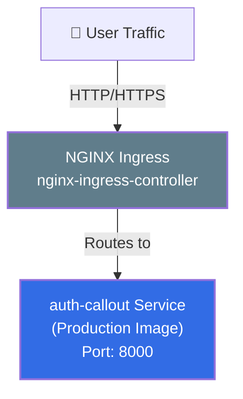
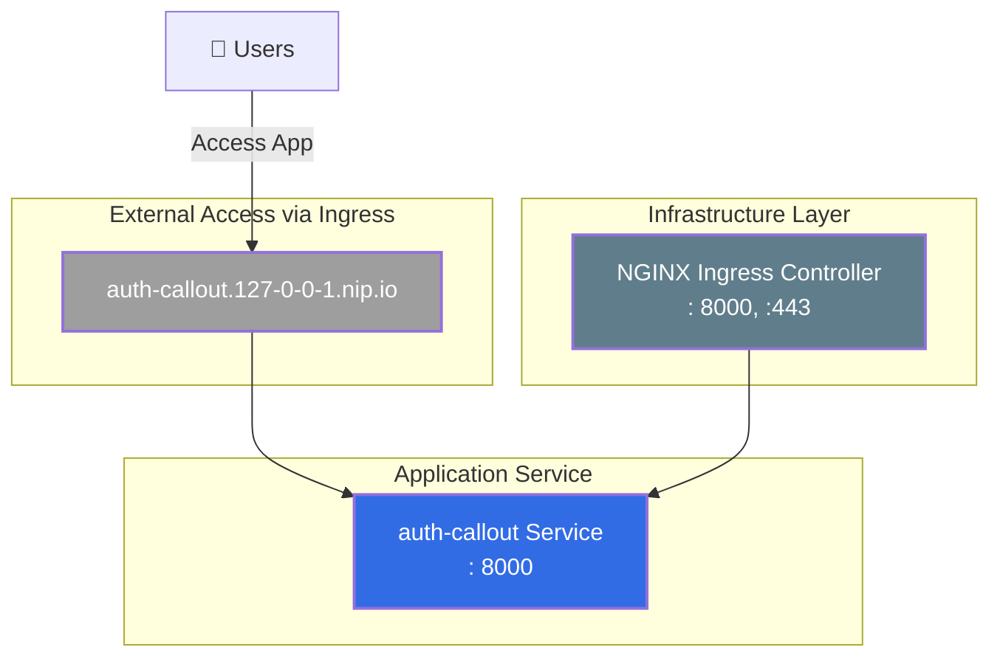
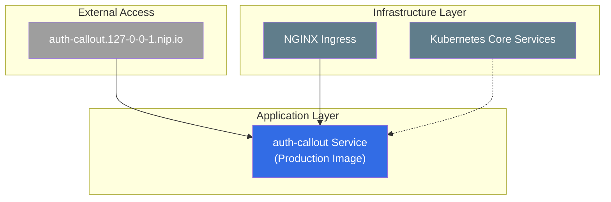

# auth-callout Service Basic Profile Deployment Architecture

This document provides a visual representation of the Kubernetes resources deployed with `devspace deploy` (basic profile - no observability).

## Application & Data Flow

## Basic Infrastructure Architecture

## Simplified Architecture View

## Resource Details

### auth-callout Namespace
- **auth-callout**: auth-callout service deployed with production image
- **auth-callout**: Kubernetes service exposing the application on port  8000
- **auth-callout-ingress**: Ingress for external access at `auth-callout.127-0-0-1.nip.io`

### Managed Namespace
- **nginx-ingress-controller**: Handles HTTP/HTTPS traffic routing for ingress resources

### Kube System Namespace
- **coredns**: DNS service for the cluster
- **etcd**: Kubernetes data store
- **kube-apiserver**: Kubernetes API server
- **kube-controller-manager**: Kubernetes controller manager
- **kube-scheduler**: Kubernetes scheduler
- **kube-proxy**: Network proxy running on each node

## Basic Features

### Application Access
1. **Application Access**: `http://auth-callout.127-0-0-1.nip.io` - Access the auth-callout service HTTP API
2. **Health Endpoints**: Built-in health check and API ping endpoints
3. **API Documentation**: Swagger/OpenAPI documentation available

### Core Functionality
1. **HTTP API**: RESTful endpoints for auth-callout operations
2. **HTTP Routing**: NGINX ingress provides external access to the service
3. **Health Checks**: Built-in health monitoring endpoints
4. **Configuration Management**: Support for environment variables, CLI flags, and config files
5. **Production Images**: Uses optimized production container images

### Available Endpoints
1. **Health Check**: `GET /healthz` - Service health status
2. **API Ping**: `GET /v1/` - API connectivity test
3. **API Documentation**: `/swagger/index.html` - Interactive API documentation

### Development Benefits
1. **Minimal Overhead**: No observability components consuming resources
2. **Fast Startup**: Quick deployment with essential components only
3. **Clean Environment**: Focused on core application functionality
4. **External Access**: Easy access to application HTTP API
5. **Stateless Design**: No database dependencies, fully stateless operation

## Key Differences from Other Profiles

The basic profile provides essential functionality without observability overhead:

1. **Minimal Footprint**: Only core application and ingress components
2. **No Observability**: No metrics collection, tracing, or monitoring components
3. **Fast Deployment**: Quicker startup without observability infrastructure
4. **Stateless Operation**: No database or external service dependencies
5. **Development with Production Images**: Uses production images suitable for core functionality testing
6. **Resource Efficient**: Minimal resource consumption for basic development needs

This profile is ideal for:
- Initial development and testing of core HTTP API functionality
- Environments with limited resources
- Quick prototyping and development cycles
- Testing application logic without observability overhead
- Learning the application architecture without complexity
- Lightweight microservice development
- API-focused development and testing
