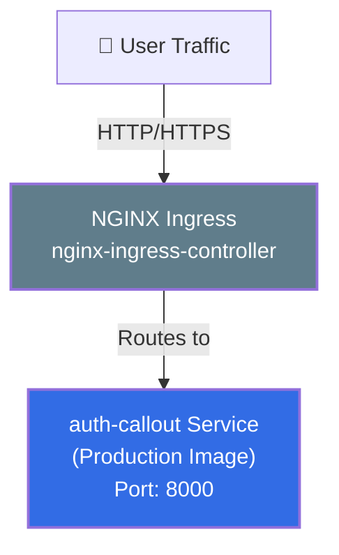
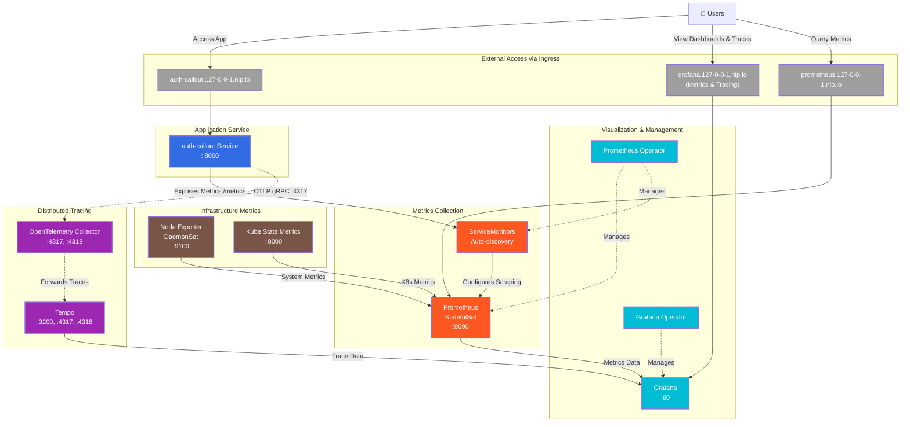
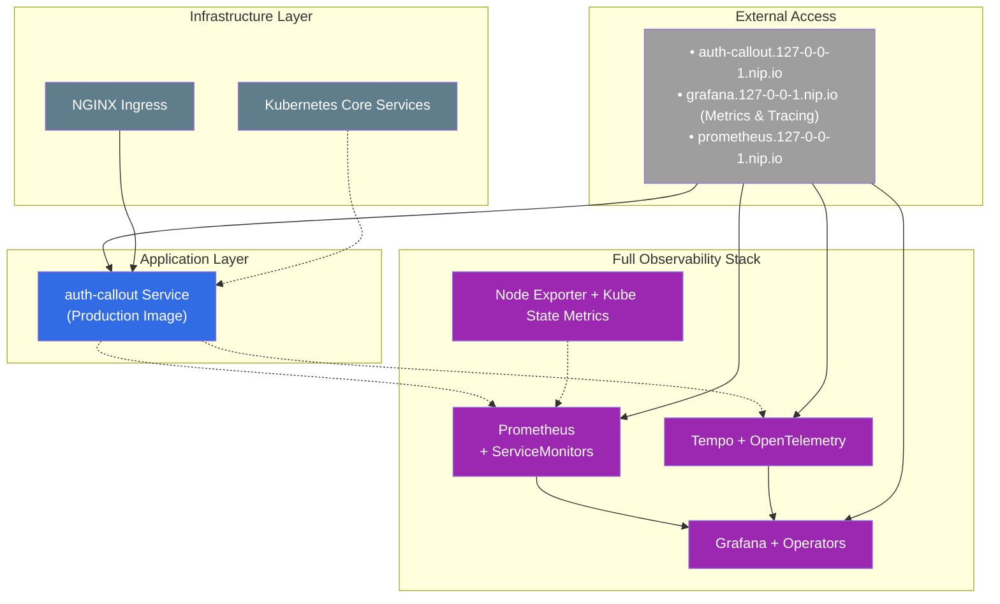

# auth-callout Service Observability Profile Deployment Architecture

This document provides a visual representation of the Kubernetes resources deployed with `devspace deploy -p obs` (full observability profile).

## Application & Data Flow

## Observability Stack Architecture

## Simplified Architecture View

## Resource Details

### auth-callout Namespace
- **auth-callout**: auth-callout service deployed with production image
- **auth-callout**: Kubernetes service exposing the application on port  8000
- **auth-callout-metrics**: Service exposing Prometheus metrics endpoint (when metrics enabled)
- **auth-callout ServiceMonitor**: Configures Prometheus to scrape auth-callout service metrics
- **auth-callout-ingress**: Ingress for external access at `auth-callout.127-0-0-1.nip.io`

### Observability Namespace (Full Stack)
**Metrics Components:**
- **prometheus-server**: Prometheus server (StatefulSet) for metrics collection and storage
- **prometheus-node-exporter**: Node Exporter (DaemonSet) for system-level metrics
- **kube-state-metrics**: Kubernetes cluster metrics collector
- **prometheus-operator**: Manages Prometheus instances and ServiceMonitors

**Tracing Components:**
- **opentelemetry-collector**: Collects and forwards telemetry data via OTLP
- **tempo**: Complete Tempo distributed tracing backend
- **tempo-0**: Tempo StatefulSet for trace storage and retrieval

**Visualization & Management:**
- **grafana**: Grafana dashboard server with metrics and tracing integration
- **grafana-operator**: Manages Grafana instances and dashboards

**External Access:**
- **prometheus-server ingress**: External access to Prometheus UI at `prometheus.127-0-0-1.nip.io`
- **grafana ingress**: External access to Grafana dashboards (including tracing) at `grafana.127-0-0-1.nip.io`

### Managed Namespace
- **nginx-ingress-controller**: Handles HTTP/HTTPS traffic routing for all ingress resources

## Observability Features

### Comprehensive Monitoring
1. **Application Metrics**: HTTP request metrics, Go runtime metrics, custom business metrics
2. **Infrastructure Metrics**: Node, container, and Kubernetes cluster metrics
3. **Distributed Tracing**: Request tracing with OpenTelemetry and Tempo integration
4. **Unified Visualization**: Grafana dashboards combining metrics and trace data

### External Access
1. **Application Access**: `http://auth-callout.127-0-0-1.nip.io:8080` - Access the auth-callout service HTTP API
2. **Grafana Dashboards**: `http://grafana.127-0-0-1.nip.io:8080` - Unified metrics and tracing visualization (includes Tempo tracing UI)
3. **Prometheus UI**: `http://prometheus.127-0-0-1.nip.io:8080` - Direct metrics queries and exploration

### Complete Observability
1. **Metrics Collection**: Comprehensive metrics collection from application and infrastructure
2. **Distributed Tracing**: End-to-end request tracing with Tempo backend
3. **Data Correlation**: Ability to correlate metrics and traces through unified Grafana interface
4. **Historical Analysis**: Time-series data for both metrics and traces

## Key Features

### Unified Observability
1. **Complete Visibility**: Both metrics and tracing data in one deployment
2. **Correlated Analysis**: Link metrics spikes to specific traced requests through unified Grafana interface
3. **Full Stack Monitoring**: Application, infrastructure, and Kubernetes monitoring
4. **Rich Dashboards**: Pre-configured Grafana dashboards with metrics and integrated Tempo tracing

### Advanced Analysis
1. **Performance Investigation**: Combine metrics trends with detailed trace analysis using Grafana's unified interface
2. **Root Cause Analysis**: Use both metrics and traces to identify issues through correlated views
3. **Capacity Planning**: Historical metrics data for resource planning
4. **Error Investigation**: Trace specific errors while monitoring overall error rates through integrated Tempo tracing

### Development Benefits
1. **Complete Debugging**: Full observability for comprehensive debugging
2. **Performance Optimization**: Identify bottlenecks using both metrics and traces
3. **Production Readiness**: Production-grade observability stack
4. **Learning Platform**: Ideal for learning complete observability practices

### Operational Excellence
1. **Alerting Foundation**: Metrics provide foundation for alerts and notifications
2. **Troubleshooting Tools**: Both high-level metrics and detailed traces for issue resolution
3. **Documentation**: Observability data serves as living system documentation
4. **Compliance**: Comprehensive monitoring for compliance and audit requirements

## Key Differences from Other Profiles

The observability profile provides complete monitoring and tracing capabilities:

1. **Full Stack**: Complete observability with both metrics and distributed tracing
2. **Unified View**: Grafana integration showing both metrics and tracing data through integrated Tempo interface
3. **Production Ready**: Enterprise-grade observability suitable for production environments
4. **Comprehensive Analysis**: Ability to perform complete performance and troubleshooting analysis
5. **Resource Intensive**: Higher resource usage due to complete observability stack
6. **Complete Toolchain**: All observability tools and integrations in one deployment

This profile is ideal for:
- Production environments requiring comprehensive observability
- Performance analysis and optimization projects
- Learning complete observability practices
- Troubleshooting complex application issues
- Environments where both metrics and tracing are essential
- Microservice architectures requiring full visibility
- Development teams that need production-like observability
- Systems requiring detailed monitoring and analysis capabilities
