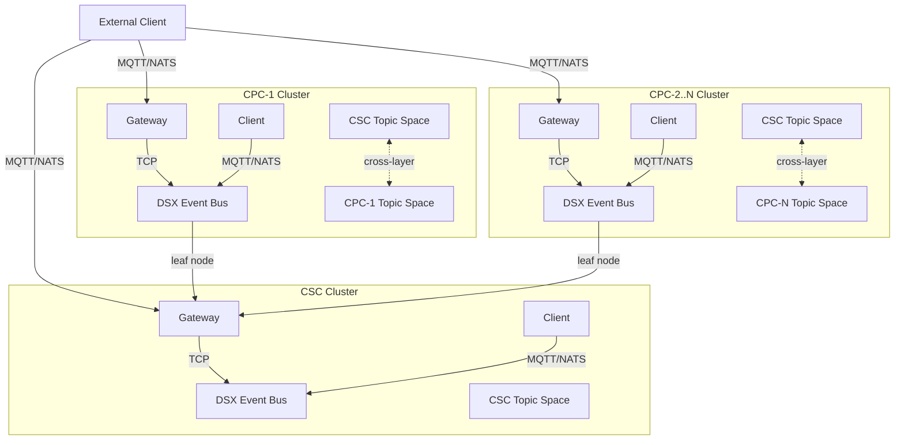
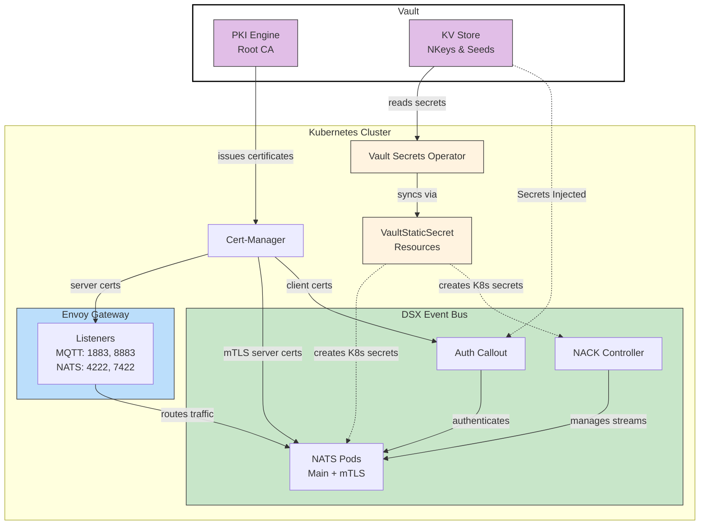
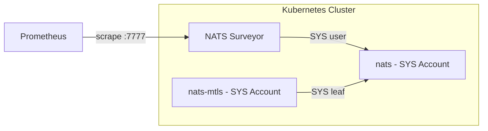

# DSX Event Bus - Deployment

NATS-based event bus for AI Factory operations. This chart is deployed **independently in each Kubernetes cluster** (one CSC, multiple CPCs). The deployments connect via leaf node federation, providing a unified CSC topic space across all clusters and independent CPC topic spaces with controlled cross-layer routing.

## Architecture Overview

This chart deploys a complete NATS event bus instance. In a multi-cluster AI Factory deployment, each cluster (CSC and each CPC) runs its own instance. These instances federate via NATS leaf node connections through Envoy Gateway.



### Topic Spaces

The event bus provides two types of topic spaces:

- **CSC Topic Space** - A unified topic space that spans all clusters. Messages published here are visible to subscribers in any cluster. Clients see full topic paths including CPC prefixes (e.g., `cpc.1.telemetry.temp`).

- **CPC Topic Spaces** - Each CPC has its own independent local topic space. Messages stay within that CPC unless the topic is configured for cross-layer routing. Clients use simple topic names without prefixes (e.g., `telemetry/temp`).

### Components Per Cluster

Each deployment includes:

- **Main NATS cluster** (3 pods) - MQTT/TCP clients, JetStream persistence
- **mTLS NATS cluster** (1 pod, optional) - mTLS authentication with leaf-node passthrough (see [mTLS MQTT Endpoint](#mtls-mqtt-endpoint))
- **NACK** (1 pod) - JetStream controller for declarative stream management
- **Auth Callout Service** (1 pod) - Single service handling authentication for both NATS clusters
- **NATS Surveyor** (1 pod) - Prometheus metrics exporter for NATS monitoring

## Prerequisites

- **Kubernetes**: 1.27+
- **Helm**: 3.12+
- Envoy Gateway operator (GatewayClass `eg`)
- MetalLB or cloud LoadBalancer
- cert-manager (for mTLS certificates)
- Prometheus Operator (for ServiceMonitor CRDs - required by Surveyor)
- Persistent storage (for JetStream file storage, if enabled)
- Keycloak or OIDC provider (if using OAuth2)
- Local access to this repository for the bundled `auth-callout` chart

### Resource Requirements

| Component | Replicas | CPU Request | Memory Request | CPU Limit | Memory Limit |
|-----------|----------|-------------|----------------|-----------|--------------|
| nats | 3 | 200m | 512Mi | 1000m | 2Gi |
| nats-mtls | 1 | 100m | 256Mi | 500m | 1Gi |
| auth-callout | 1 | 10m | 32Mi | 100m | 128Mi |
| nack | 1 | 10m | 32Mi | 100m | 128Mi |
| surveyor | 1 | 10m | 32Mi | 100m | 128Mi |

### Install Order

1. Infrastructure (Envoy Gateway, MetalLB, cert-manager)
2. Keycloak (if using OAuth2)
3. CSC cluster
4. CPC clusters (connect to CSC via leaf nodes)

### Required Secrets

Secret name and key are overridable, these are the defaults.

**NATS Server Auth:**

| Secret | Keys | Purpose |
|--------|------|---------|
| `nats-auth-signing` | pubkey | AUTH account signing key |
| `nats-xkey` | pubkey | Encryption XKey |

**Auth-Callout Service:**

| Secret | Keys | Purpose |
|--------|------|---------|
| `nats-authx-user` | pubkey | Auth-callout NATS connection user |
| `auth-callout-keys` | nkey-seed, issuer-seed, xkey-seed | Auth-callout signing and encryption keys |

**NACK Controller:**

| Secret | Keys | Purpose |
|--------|------|---------|
| `nats-nack-user` | nack-user.nk | NACK NKey file (used by nack subchart) |
|                  | pubkey | NACK user pubkey (for auth-callout permissions) |

**mTLS Server** (only when `eventBus.mtls.enabled: true`)**:**

| Secret | Keys | Purpose |
|--------|------|---------|
| `nats-mtls-server-tls` | ca.crt, tls.crt, tls.key | mTLS server certificates |

**mTLS Leaf Connections** (only when `eventBus.mtls.enabled: true`)**:**

| Secret | Keys | Purpose |
|--------|------|---------|
| `nats-mtls-leaf` | seed, pubkey | DC account leaf connection |
| `nats-mtls-authx-leaf` | seed, pubkey | AUTHX account leaf connection |
| `nats-mtls-sys-leaf` | seed, pubkey | SYS account leaf connection (monitoring) |

**Surveyor (monitoring):**

| Secret | Keys | Purpose |
|--------|------|---------|
| `nats-surveyor` | seed, pubkey | Surveyor NKey for SYS account access |

**Cross-Cluster Leaf Connections:**

Each CPC gets a `nats-leaf-csc` secret. The CSC gets the pubkey for all of those CPCs.

| Secret | Keys | Purpose |
|--------|------|---------|
| `nats-leaf-csc` | seed | CPC to CSC leaf (CPC only) |
| `nats-leaf-cpc-{id}` | pubkey | CPC leaf users (CSC only, via auth-callout.extraEnvs) |

### Generating Secrets

An example script is provided to generate all required secrets to local files:

```bash
# Generate secrets for a cluster
./scripts/generate-nkeys.sh [OPTIONS] -c CLUSTER [cpc-ids...]

# Options:
#   -c, --cluster CLUSTER    Cluster name: csc or cpc-{id}
#   -o, --output DIR         Output directory (default: deploy/secrets/{cluster})
#       --force              Overwrite an existing non-empty output directory
#   -h, --help               Show help message

# Examples:
./scripts/generate-nkeys.sh -c csc 1 2 3              # Generate for CSC, output to deploy/secrets/csc
./scripts/generate-nkeys.sh -c cpc-1 -o ./my-secrets  # Generate for CPC-1, custom output directory
```

The script generates all required NKey secrets (operator, accounts, users, XKey).
It refuses to overwrite an existing non-empty output directory. Use `--force`
only when intentionally rotating all generated NKeys for that cluster. Rotating
these keys invalidates existing leaf, auth-callout, NACK, mTLS, and surveyor
credentials created from the previous output.

Generated secret files are written with mode `0600`, and generated secret
directories are written with mode `0700`. Treat the full output directory as
sensitive material.

Output structure:
```
deploy/secrets/{cluster}/
└── nkeys/
    ├── nats-auth-signing/{seed,pubkey}
    ├── nats-xkey/{seed,pubkey}
    ├── nats-authx-user/{seed,pubkey}
    ├── nats-nack-user/{seed,pubkey,nack-user.nk}
    ├── nats-mtls-leaf/{seed,pubkey}
    ├── nats-mtls-authx-leaf/{seed,pubkey}
    ├── nats-mtls-sys-leaf/{seed,pubkey}
    ├── nats-surveyor/{seed,pubkey}
    ├── auth-callout-keys/{nkey-seed,issuer-seed,xkey-seed}
    └── nats-leaf-cpc-{id}/{seed,pubkey}   # CSC only (when CPC IDs provided)
```

## Chart Dependencies

This umbrella chart bundles the following subcharts:

| Chart | Alias | Documentation |
|-------|-------|---------------|
| nats | `nats` | [nats-io/k8s](https://github.com/nats-io/k8s/tree/main/helm/charts/nats) |
| nats | `nats-mtls` | [nats-io/k8s](https://github.com/nats-io/k8s/tree/main/helm/charts/nats) (condition: `eventBus.mtls.enabled`) |
| nack | `nack` | [nats-io/nack](https://github.com/nats-io/nack) |
| auth-callout | `auth-callout` | [auth-callout/deploy](../auth-callout/deploy/README.md) |
| surveyor | `surveyor` | [nats-io/nats-surveyor](https://github.com/nats-io/nats-surveyor) |

## Installation

```bash
# Update dependencies
helm dependency update ./nats-event-bus

# Install (dry-run first)
helm install dsx ./nats-event-bus -n dsx --create-namespace --dry-run

# Install
helm install dsx ./nats-event-bus -n dsx --create-namespace

# With custom values
helm install dsx ./nats-event-bus -n dsx --create-namespace -f values-csc.yaml
```

## Umbrella Chart Configuration

These values are specific to this umbrella chart (not passed to subcharts).

### Gateway Routes

Configure TCPRoute/TLSRoute resources for Envoy Gateway:

```yaml
gateway:
  routes:
    mqtt:
      enabled: true
      kind: TCPRoute              # TCPRoute or TLSRoute
      gatewayName: shared-gateway
      gatewayNamespace: envoy-gateway-system
      sectionName: mqtt
    natsClient:
      enabled: true
      kind: TCPRoute
      gatewayName: shared-gateway
      gatewayNamespace: envoy-gateway-system
      sectionName: nats-client
    natsLeafnode:
      enabled: true
      kind: TCPRoute
      gatewayName: shared-gateway
      gatewayNamespace: envoy-gateway-system
      sectionName: nats-leafnode
    mqttMtls:
      enabled: true
      kind: TCPRoute
      gatewayName: shared-gateway
      gatewayNamespace: envoy-gateway-system
      sectionName: mqtt-mtls
```

### MQTT Streams

Configure JetStream streams for MQTT persistence (managed by NACK):

```yaml
mqttStreams:
  maxBytes: 67108864  # 64MB per stream
  replicas: 3         # stream replicas (match NATS cluster size)
  storage: memory     # memory or file
```

## Event Bus Configuration

The `eventBus` section provides a high-level API for configuring the event bus. Internal NATS details (accounts, mappings, leaf nodes) are auto-generated based on `clusterType`.

### Cluster Type

Set `eventBus.clusterType` to configure the cluster:

```yaml
eventBus:
  clusterType: cpc        # "csc" or "cpc"
  clusterId: "1"          # Required for CPC clusters
  cscEndpoint: "nats://csc-gateway:7422"  # Required for CPC clusters
  cpcIds: ["1", "2"]      # CSC only: which CPCs will connect as leaves
```

| Field | Default | Purpose |
|-------|---------|---------|
| `clusterType` | `csc` | "csc" or "cpc" - auto-configures accounts, leaf nodes, JetStream domains |
| `clusterId` | `null` | CPC only: unique identifier for this CPC (used in prefixes) |
| `cscEndpoint` | `null` | CPC only: CSC's external NATS leaf node endpoint |
| `cpcIds` | `null` | CSC only: list of CPC IDs that will connect as leaves |

### Cross-Layer Subject Routing

Cross-layer configuration controls which topics are copied between the CPC local topic space and the CSC unified topic space.

#### Routing Behavior

- Topics in `cpcExports` are copied from CPC topic space to CSC topic space with a `cpc.{id}.` prefix added
- Topics in `cscExports` are copied from CSC topic space to all CPC topic spaces (no prefix change)
- Topics in `cscPrefixedExports` matching `cpc.{id}.` are copied to that specific CPC topic space with the prefix stripped

#### Configuration

```yaml
eventBus:
  crossLayer:
    cscExports: ["events.>"]          # subjects exported from CSC
    cscPrefixedExports: ["commands"]  # subjects with CPC prefix
    cpcExports: ["telemetry.>"]       # subjects exported from CPC
```

| Field | Purpose |
|-------|---------|
| `cscExports` | Subjects broadcast from CSC to all CPC topic spaces |
| `cscPrefixedExports` | Subjects targeted to specific CPC (prefix stripped on delivery) |
| `cpcExports` | Subjects exported from this CPC to CSC (prefix added) |

This generates NATS account import/export rules in `nats-accounts-config.yaml`.

### Extra Accounts

Add cluster-wide NATS accounts with automatic configuration:

```yaml
eventBus:
  extraAccounts:
    LaunchLayer:
      jetstream: true  # CSC only - CPCs always force JetStream off with domain mapping
    Kiwi: {}  # Minimal account with defaults
```

All properties are passed through to the NATS account configuration. On CPCs, `jetstream` is always forced to `false` and a JetStream domain mapping to CSC is automatically added.

### mTLS MQTT Endpoint

The chart can deploy a separate NATS instance (`nats-mtls`) that accepts MQTT connections authenticated with client certificates (mTLS). This instance has no JetStream of its own; it connects to the main NATS cluster via leaf nodes and forwards auth requests through the shared auth-callout service.

```yaml
eventBus:
  mtls:
    enabled: true  # default
```

Set `eventBus.mtls.enabled: false` to disable the mTLS NATS cluster. When disabled:

- The `nats-mtls` subchart is not rendered (no pods, services, or config)
- The `mqttMtls` gateway route is not created
- The `nats-mtls-accounts-config` ConfigMap is not created
- mTLS-specific keys are omitted from `nats-env-config`
- mTLS leaf nkey entries are omitted from the auth-callout permissions
- The mTLS secrets (`nats-mtls-server-tls`, `nats-mtls-leaf`, `nats-mtls-authx-leaf`, `nats-mtls-sys-leaf`) are not required

## Subchart Configuration

Configure subcharts by prefixing values with the chart alias.

### NATS (`nats.*` and `nats-mtls.*`)

```yaml
nats:
  config:
    cluster:
      replicas: 3
    jetstream:
      enabled: true
    mqtt:
      enabled: true
```

See [NATS Helm chart documentation](https://github.com/nats-io/k8s/tree/main/helm/charts/nats). For required environment variables, see [Environment Variables](#environment-variables).

### Auth Callout (`auth-callout.*`)

A single auth callout service handles authentication for both the main NATS cluster and mTLS NATS cluster. The mTLS NATS cluster forwards authentication requests to the main NATS cluster via a leaf node connection.

```yaml
auth-callout:
  serviceConfig:
    nats:
      url: "nats://nats:4222"
    jwks:
      url: "https://keycloak.example.com/realms/event-bus/protocol/openid-connect/certs"
      issuer: "https://keycloak.example.com/realms/event-bus"
```

Auth permissions are configured via `eventBus.auth.permissions`, not under `auth-callout`. See [auth-callout Helm chart documentation](../auth-callout/deploy/README.md).

### NACK (`nack.*`)

```yaml
nack:
  jetstream:
    enabled: true
    nats:
      url: "nats://nats:4222"
```

See [NACK documentation](https://github.com/nats-io/nack).

## Environment Variables

The NATS config uses `<< $VAR >>` placeholders resolved at container runtime. The umbrella chart pre-configures these environment variables to pull values from Kubernetes secrets (see [Required Secrets](#required-secrets)). Operators generally do not need to override these unless using a non-standard secret structure.

## Recommended Setup

This section describes the recommended setup to bring up the Event Bus. In this setup the following components are used:
* Vault:
  * Store NKeys
  * Store Root CA
  * Issues new certificates signed by the root CA.
* Vault Secrets Operator:
  * Responsible for materializing Kubernetes secrets from secrets stored in Vault
* Vault Agent Injector:
  * Responsible for injecting secrets directly into Auth-Callout.
* Cert-Manager - Manages the creation of TLS certificates:
  * Uses Vault to issue certificates:
    * Client certificates.
    * TLS server certificate.
* Gateway - Gateway API responsible for creating listeners for the routes exposed by this helm chart.
  * Uses TLS certificates created by Cert-Manager.

The following diagram describes how the components interact:


### Gateway

A Gateway controller must be installed in the cluster for Gateway resources to be successfully created. One possible implementation for this controller is the [Envoy Gateway](https://gateway.envoyproxy.io/)

The minimal recommended configuration is:
```
apiVersion: gateway.networking.k8s.io/v1
kind: Gateway
metadata:
  name: event-bus-gateway
spec:
  gatewayClassName: eg
  listeners:
    - name: mqtt
      protocol: TLS
      port: 1883
      allowedRoutes:
        namespaces:
          from: All
      tls:
        mode: Terminate
        certificateRefs:
        - kind: Secret
          name: event-bus-server-tls-certificate
    - name: nats-client
      protocol: TLS
      port: 4222
      allowedRoutes:
        namespaces:
          from: All
      tls:
        mode: Terminate
        certificateRefs:
        - kind: Secret
          name: event-bus-server-tls-certificate
    - name: nats-leafnode
      protocol: TLS
      port: 7422
      allowedRoutes:
        namespaces:
          from: All
      tls:
        mode: Terminate
        certificateRefs:
        - kind: Secret
          name: event-bus-server-tls-certificate
    - name: mqtt-mtls
      protocol: TLS
      port: 8883
      allowedRoutes:
        namespaces:
          from: All
      tls:
        # TLS Termination happens in the application instead because we need to verify the client certificate
        mode: Passthrough
  infrastructure:
    parametersRef:
      group: gateway.envoyproxy.io
      kind: EnvoyProxy
      name: event-bus-proxy-config
```

All endpoints that have TLS terminated in the gateway need to reference a secret of type `kubernetes.io/tls` created by Cert-Manager using the `Certificate` resource.

Example:
```
apiVersion: cert-manager.io/v1
kind: Certificate
metadata:
  name: event-bus-mtls-certificate
spec:
  secretName: event-bus-mtls-certificate
  issuerRef:
    name: event-bus-certificate-issuer
    kind: Issuer
  commonName: "event-bus.example.com"
  dnsNames:
    - "event-bus.example.com"
```

The name of the listeners has to match the name of the sections in the gateway route properties defined in this helm chart. The kind of route also has to be chosen according to the type of listener.

```
gateway:
  routes:
    # TLS Termination will result in a TCP route down to the NATS server
    mqtt:
      kind: TCPRoute
      gatewayName: event-bus-gateway
      gatewayNamespace: event-bus
    natsClient:
      kind: TCPRoute
      gatewayName: event-bus-gateway
      gatewayNamespace: event-bus
    natsLeafnode:
      kind: TCPRoute
      gatewayName: event-bus-gateway
      gatewayNamespace: event-bus
    mqttMtls:
      kind: TLSRoute
      gatewayName: event-bus-gateway
      gatewayNamespace: event-bus
```

### Vault & Vault Secrets Operator

Vault is used to store secrets in the KV secrets engine, the Root CA for Event-bus and a PKI secrets engine that is able to issue certificates signed by the Root CA.

References:
* [Vault KV Secret Engine](https://developer.hashicorp.com/vault/docs/secrets/kv)
* [PKI Secrets Engine](https://developer.hashicorp.com/vault/docs/secrets/pki)

The Vault Secrets Operator is responsible for materializing secrets stored in Vault KVs into Kubernetes Secrets:

References:
* [Vault Secrets Operator](https://developer.hashicorp.com/vault/docs/deploy/kubernetes/vso)

After you have both in place, you can fetch secrets with a `VaultStaticSecret`.


Example:
```
apiVersion: secrets.hashicorp.com/v1beta1
kind: VaultStaticSecret
metadata:
  name: nack-user
spec:
  type: kv-v2
  # Name of the CRD to authenticate to Vault
  vaultAuthRef: vault-secrets-operator-system/vault-auth
  # mount path
  mount: kv/components
  # path of the secret
  path: event-bus/nack-user
  destination:
    name: nack-user
    create: true
    type: "Opaque"
```

This secret can then be referenced by the workloads.

#### NKeys

NKeys are a new, highly secure public-key signature system based on Ed25519. An operator is responsible by setting up the NKeys used by Event-Bus and store them in Vault so that later they can be used by the workloads either by injecting them or by using the Vault Secrets Operator to materialize a secret from a vault secret containing the key.

The `nsc` utility should be used to generate NKeys:

```
nsc generate nkey --user # user nkey - Provides user authentication
nsc generate nkey --account # auth nkey - Used to sign auth-callout requests
nsc generate nkey --curve # xkey - Used in Auth-Callout to encrypt the payload used for authentication/authorization
```

You will need to create the following keys:


| key | type | required |
|---- | ---- | ---- |
| auth-signing | auth nkey | always |
| authx-user | user nkey | always |
| authx-leaf-user | user nkey | when `eventBus.mtls.enabled` |
| mtls-leaf-user | user nkey | when `eventBus.mtls.enabled` |
| mtls-sys-leaf-user | user nkey | when `eventBus.mtls.enabled` |
| nack-user | user nkey | always |
| surveyor | user nkey | always |
| xkey | xkey | always |


References:
* [nsc](https://docs.nats.io/using-nats/nats-tools/nsc)
* [Auth NKeys](https://docs.nats.io/running-a-nats-service/configuration/securing_nats/auth_intro/nkey_auth)
* [Auth-Callout Nkey](https://docs.nats.io/running-a-nats-service/configuration/securing_nats/auth_callout)
### Cert-Manager

A Vault issuer is used so that Cert-Manager can authenticate into Vault to get certificates signed by the Root CA.

References:
* [Vault Issuer](https://cert-manager.io/docs/configuration/vault/)

## Exposed Ports

External access via Envoy Gateway TCPRoutes:

| Port | Protocol | Service | Description |
|------|----------|---------|-------------|
| 1883 | MQTT | nats | Standard MQTT 3.1.1 (TLS terminated at Envoy) |
| 4222 | NATS | nats | NATS client connections |
| 7422 | NATS | nats | Leaf node connections (cross-cluster federation) |
| 8883 | MQTT | nats-mtls | mTLS MQTT 3.1.1 (TCP passthrough, TLS at NATS pod) |

### Internal Services

| Service | Port | Description |
|---------|------|-------------|
| `nats:4222` | 4222 | Main NATS clients |
| `nats:7422` | 7422 | Leaf nodes |
| `nats:1883` | 1883 | MQTT 3.1.1 |
| `nats-mtls:4222` | 4222 | mTLS NATS clients |
| `nats-mtls:1883` | 1883 | mTLS MQTT 3.1.1 |
| `surveyor:7777` | 7777 | Prometheus metrics |

## Monitoring

NATS Surveyor exports Prometheus metrics from the NATS cluster. The mTLS cluster's SYS account is federated to the main cluster via leaf node, enabling centralized monitoring of both clusters.

**Prerequisite:** Prometheus Operator must be installed for the ServiceMonitor CRD. Install via `kube-prometheus-stack` Helm chart or equivalent.

### Surveyor Configuration

Surveyor is configured via the `surveyor` section in values:

```yaml
surveyor:
  config:
    servers: "nats://nats:4222"   # NATS connection URL
    expectedServers: 3            # Expected cluster size
    accounts: true                # Enable account metrics
    jsz: all                      # JetStream metrics (streams, consumers)
    nkey:                         # NKey authentication to SYS account
      secret:
        name: nats-surveyor
        key: seed
  serviceMonitor:
    enabled: true                 # Create ServiceMonitor for Prometheus
```

### Metrics

Surveyor exposes metrics on port 7777 at `/metrics`. Key metric families:

- `nats_core_*` - Core server metrics (connections, messages, bytes)
- `nats_account_*` - Per-account metrics
- `nats_jetstream_*` - JetStream stream/consumer metrics

See [NATS Surveyor documentation](https://github.com/nats-io/nats-surveyor) for the complete metrics reference.

### Monitoring Architecture



## Validation

```bash
# Check all pods are running
kubectl get pods -n dsx

# Test MQTT connectivity
mqttx pub -h $GATEWAY_IP -p 1883 -t test/topic -m "hello" \
  -u "oauth2" -P "$ACCESS_TOKEN" -V 3.1.1

# Or test NATS connectivity
nats pub test.topic "hello" --server nats://$GATEWAY_IP:4222
```

## Example Deployment

This example deployment uses layered values files: common values shared across clusters, cluster-type values (CSC or CPC), and cluster-specific overrides.

### Common Values (all clusters)

```yaml
# local-dev-values.yaml - shared across all clusters
auth-callout:
  serviceConfig:
    jwks:
      url: "https://keycloak.example.com/realms/event-bus/protocol/openid-connect/certs"
      issuer: "https://keycloak.example.com/realms/event-bus"
    mtls:
      ca-path: "/etc/mtls-ca/ca.crt"
```

### CSC Cluster

```yaml
# csc/values.yaml
eventBus:
  clusterType: csc
  cpcIds: ["1", "2"]
  auth:
    permissions:
      oauth2:
        mqtt-client:
          azp: "mqtt-client"
          account: "CSC"
          permissions:
            pub:
              allow: ["events.>"]
            sub:
              allow: ["events.>"]
      mtls:
        mqtt-client:
          identity: "CN=mqtt-client.csc"
          account: "CSC"
      noauth:
        account: "CSC"

# CSC needs CPC leaf user pubkeys to authorize incoming leaf connections.
# This block is mandatory when eventBus.cpcIds is non-empty. Add one
# entry per CPC cluster, matching the IDs in cpcIds.
auth-callout:
  extraEnvs:
    NKEY_LEAF_CPC_1_PUBKEY:
      valueFrom:
        secretKeyRef:
          name: nats-leaf-cpc-1
          key: pubkey
    NKEY_LEAF_CPC_2_PUBKEY:
      valueFrom:
        secretKeyRef:
          name: nats-leaf-cpc-2
          key: pubkey
```

The chart validates that every `eventBus.cpcIds` entry has a matching
`NKEY_LEAF_CPC_{N}_PUBKEY` entry under `auth-callout.extraEnvs`.

### CPC Cluster

```yaml
# cpc/values.yaml
eventBus:
  clusterType: cpc
  clusterId: "1"
  cscEndpoint: "nats://csc.example.com:7422"
  crossLayer:
    cscExports: ["broadcast.>"]
    cscPrefixedExports: ["command.>"]
    cpcExports: ["sensor.>"]
  auth:
    permissions:
      oauth2:
        mqtt-client:
          azp: "mqtt-client"
          account: "CPC"
          permissions:
            pub:
              allow: ["events.>"]
            sub:
              allow: ["events.>"]
      mtls:
        mqtt-client:
          identity: "CN=mqtt-client.cpc-1"
          account: "CPC"
      noauth:
        account: "CPC"
```
