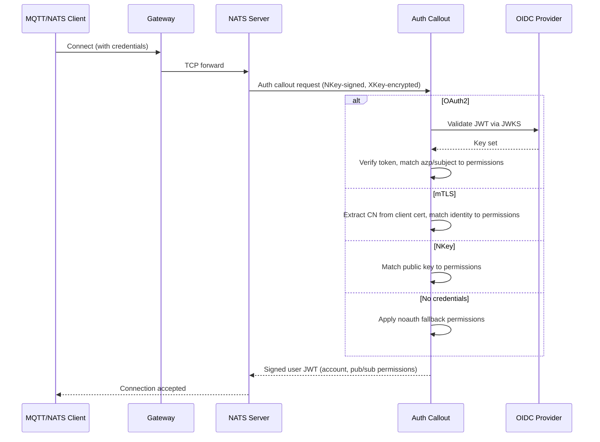

# Authentication

Every signal on DSX Exchange has a verified origin. Every subscriber is authorized for the topics it reads. This is enforced by the auth-callout service — a NATS Auth Callout that authenticates all client connections and issues topic-level permissions at connect time.

A single auth-callout instance handles authentication for both the main NATS cluster and the optional mTLS NATS cluster within each Kubernetes cluster. The auth model maps to two primary integration patterns: OAuth2 (JWT) for software clients, agents, and MCP interfaces; mTLS (X.509 client certificates) for BMS and OT devices that connect over MQTT.

## Auth Flow



## Auth Modes

### OAuth2 (JWT/JWKS)

Clients connect with a username of `oauthtoken` and an access token as the password. The auth-callout validates the token against the OIDC provider's JWKS endpoint and matches the token's `azp` (authorized party) or `subject` claim to a permissions entry.

Configure the JWKS endpoint and issuer in the Helm values for **every cluster** (CSC and each CPC). Without these values, that cluster's auth-callout cannot validate JWTs and silently rejects all OAuth2 connections:

```yaml
auth-callout:
  serviceConfig:
    jwks:
      url: "https://keycloak.example.com/realms/event-bus/protocol/openid-connect/certs"
      issuer: "https://keycloak.example.com/realms/event-bus"
```

### mTLS (X.509 Client Certificates)

BMS and OT devices connect to the mTLS NATS endpoint (port 8883) with a client certificate. TLS is terminated at the NATS pod (the Gateway API controller uses TCP passthrough for this listener). The auth-callout extracts the certificate's Common Name and matches it to a permissions entry.

Configure the CA certificate path:

```yaml
auth-callout:
  serviceConfig:
    mtls:
      ca-path: "/etc/mtls-ca/ca.crt"
```

### NKey

Internal system components (leaf node connections, NACK controller, Surveyor) authenticate with NATS NKey signatures. Partner integrations can also use NKey auth where certificate infrastructure is not available.

### NoAuth (Anonymous Fallback)

Connections that don't match any other auth mode receive the noauth permissions. This mode is intended for development and debugging only — it should not be enabled in production deployments.

### Auth Mode Identifier Reference

| Type | Identifier Field | Matched Against |
|------|------------------|-----------------|
| `oauth2` | `azp` or `subject` | JWT token claims validated via JWKS |
| `mtls` | `identity` | X.509 certificate Common Name |
| `nkey` | `public_key` | NATS NKey public key |
| `noauth` | (none) | Anonymous access fallback |

## Configuring Permissions

Permissions are configured under `global.eventBus.auth.permissions` in the Helm values. Each entry maps an authenticated identity to a NATS account and a set of pub/sub topic rules.

```yaml
global:
  eventBus:
    auth:
      permissions:
        oauth2:
          mqtt-client:
            azp: "mqtt-client"
            account: "CSC"
            permissions:
              pub:
                allow: ["events.>"]
              sub:
                allow: ["events.>"]
        mtls:
          bms-gateway:
            identity: "CN=bms.cpc-1"
            account: "DEVICES"
            permissions:
              pub:
                allow: ["sensors.>"]
              sub:
                allow: ["commands.>"]
        noauth:
          account: "ANONYMOUS"
          permissions:
            pub:
              allow: ["public.>"]
            sub:
              allow: ["public.>"]
```

The chart renders this into a ConfigMap that the auth-callout pod mounts.

### Permission Fields

| Field | Purpose |
|-------|---------|
| `account` | NATS account the client is placed into |
| `pub.allow` | Subjects the client can publish to |
| `sub.allow` | Subjects the client can subscribe to |
| `resp` | Optional request-reply settings (`max`, `ttl`) |

Subject wildcards: `*` matches one token, `>` matches one or more tokens.

## Secrets Management

The auth-callout service requires three NKey seeds, provided as Kubernetes Secrets (Vault with Vault Secrets Operator is one option for managing these, but any secrets pipeline that materializes Kubernetes Secrets works):

| Key | Seed Prefix | Public Key Prefix | Purpose |
|-----|-------------|-------------------|---------|
| `nkey-seed` | `SU` | `U` | Auth-callout connects to NATS |
| `issuer-seed` | `SA` | `A` | Signs user JWTs for authenticated clients |
| `xkey-seed` | `SX` | `X` | Encrypts auth callout responses (optional) |

Seeds are secrets and must never be stored in plain text. Public keys derived from these seeds are configured in the NATS server config. See [Pre-Deployment](pre-deployment.md) for the full secrets inventory and generation script.

## Auth Metrics

Auth-callout exposes Prometheus metrics at `:9090/metrics`:

| Metric | Type | Description |
|--------|------|-------------|
| `auth_requests_total` | counter | Total auth callout requests |
| `auth_errors_total` | counter | Total auth callout errors |
| `auth_request_duration_seconds` | histogram | Auth request latency |
| `auth_oauth2_attempts_total` | counter | OAuth2 auth attempts |
| `auth_mtls_attempts_total` | counter | mTLS auth attempts |
| `auth_nkey_attempts_total` | counter | NKey auth attempts |
| `auth_noauth_attempts_total` | counter | NoAuth auth attempts |

Each `*_attempts_total` metric has a corresponding `*_failures_total` counter.
