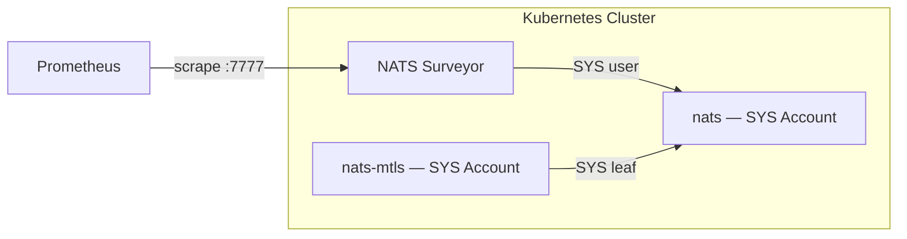

# Operations

Day-2 operational reference for the DSX Event Bus: monitoring, configuration tuning, service internals, and the chart structure.

## Monitoring

### Surveyor Configuration

NATS Surveyor exports Prometheus metrics from the NATS cluster. Configure via the `surveyor` section in Helm values:

```yaml
surveyor:
  config:
    servers: "nats://nats:4222"
    expectedServers: 3
    accounts: true
    jsz: all
    nkey:
      secret:
        name: nats-surveyor
        key: seed
  serviceMonitor:
    enabled: true
```

Prometheus Operator must be installed for the ServiceMonitor CRD.

### Monitoring Architecture

The mTLS cluster's SYS account is federated to the main cluster via leaf node, enabling centralized monitoring of both NATS instances from a single Surveyor.



### NATS Metrics

Surveyor exposes metrics on port 7777 at `/metrics`:

- `nats_core_*` — core server metrics (connections, messages, bytes)
- `nats_account_*` — per-account metrics
- `nats_jetstream_*` — JetStream stream and consumer metrics

### Auth-Callout Metrics

Auth-callout exposes Prometheus metrics at `:9090/metrics`:

| Metric | Type | Description |
|--------|------|-------------|
| `auth_requests_total` | counter | Total auth callout requests |
| `auth_errors_total` | counter | Total auth callout errors |
| `auth_request_duration_seconds` | histogram | Auth request latency |
| `auth_oauth2_attempts_total` | counter | OAuth2 attempts |
| `auth_oauth2_failures_total` | counter | OAuth2 failures |
| `auth_mtls_attempts_total` | counter | mTLS attempts |
| `auth_mtls_failures_total` | counter | mTLS failures |
| `auth_nkey_attempts_total` | counter | NKey attempts |
| `auth_nkey_failures_total` | counter | NKey failures |
| `auth_noauth_attempts_total` | counter | NoAuth attempts |
| `auth_noauth_failures_total` | counter | NoAuth failures |

### Health Endpoints

| Endpoint | Port | Purpose |
|----------|------|---------|
| `/healthz` | 8080 | Auth-callout liveness/readiness |
| `/metrics` | 9090 | Auth-callout Prometheus metrics |
| `/metrics` | 7777 | Surveyor Prometheus metrics |

## Internal Services

Kubernetes service names and ports within the `dsx` namespace:

| Service | Port | Description |
|---------|------|-------------|
| `nats:4222` | 4222 | Main NATS clients |
| `nats:7422` | 7422 | Leaf node connections |
| `nats:1883` | 1883 | MQTT 3.1.1 |
| `nats-mtls:4222` | 4222 | mTLS NATS clients |
| `nats-mtls:1883` | 1883 | mTLS MQTT 3.1.1 |
| `surveyor:7777` | 7777 | Prometheus metrics |

## Configuration Reference

### mTLS Endpoint

The mTLS NATS cluster is enabled by default. It deploys a separate NATS instance that accepts MQTT connections authenticated with client certificates. This instance has no local JetStream; it connects to the main NATS cluster via leaf nodes.

```yaml
global:
  eventBus:
    mtls:
      enabled: true   # default
```

When disabled (`global.eventBus.mtls.enabled: false`):

- No `nats-mtls` pods, services, or config deployed
- No `mqttMtls` gateway route created
- mTLS-specific environment variables omitted
- mTLS leaf NKey entries omitted from auth-callout permissions
- mTLS secrets not required

### MQTT Stream Configuration

JetStream streams for MQTT persistence are managed declaratively by the NACK controller:

```yaml
global:
  eventBus:
    mqttStreams:
      maxBytes: 67108864   # 64MB per stream
      replicas: 3          # match NATS cluster size
      storage: memory      # memory or file
```

### Extra Accounts

Add cluster-wide NATS accounts beyond the defaults:

```yaml
global:
  eventBus:
    extraAccounts:
      LaunchLayer:
        jetstream: true
      Kiwi: {}             # minimal account with defaults
```

Properties are passed through to the NATS account configuration on each cluster. CPC leaf nodes bridge enabled extra accounts to CSC, while each account keeps its own permissions and JetStream API surface.

### Subchart Configuration

Configure subcharts by prefixing values with the chart alias:

```yaml
# NATS cluster
nats:
  config:
    cluster:
      replicas: 3
    jetstream:
      enabled: true
    mqtt:
      enabled: true

# Auth callout
auth-callout:
  serviceConfig:
    nats:
      url: "nats://nats:4222"
    jwks:
      url: "https://keycloak.example.com/realms/event-bus/protocol/openid-connect/certs"
      issuer: "https://keycloak.example.com/realms/event-bus"

# NACK controller
nack:
  jetstream:
    enabled: true
    nats:
      url: "nats://nats:4222"
```

## Teardown

`helm uninstall` removes chart-managed resources but leaves operator-provisioned secrets and service accounts in place. This is intentional — the chart does not own those resources.

### Chart uninstall

Run on each cluster (CSC and every CPC):

```bash
helm uninstall dsx -n dsx
```

### Removing operator-provisioned resources

If you want a full teardown, delete the secrets and service accounts that were created during pre-deployment. These survive `helm uninstall` because they were created outside the chart:

```bash
# NKey and TLS secrets
kubectl -n dsx delete secret \
  auth-callout-keys event-bus-server-tls-certificate \
  nats-auth-signing nats-authx-user nats-leaf-csc \
  nats-nack-user nats-surveyor nats-xkey \
  --ignore-not-found

# mTLS secrets (if mTLS was enabled)
kubectl -n dsx delete secret \
  nats-mtls-server-tls nats-mtls-leaf nats-mtls-authx-leaf nats-mtls-sys-leaf \
  --ignore-not-found

# Secrets pipeline service accounts (if applicable)
kubectl -n dsx delete sa event-bus-pki nats-event-bus-vso --ignore-not-found
```

### Full namespace reset

To remove everything including the namespace:

```bash
kubectl delete ns dsx --ignore-not-found
```

If using a Vault-backed secrets pipeline, also remove the Vault PKI role, KV paths, and per-cluster Kubernetes auth mounts for a true clean slate.

## Chart Dependencies

The `nats-event-bus` umbrella chart bundles these subcharts:

| Chart | Alias | Condition |
|-------|-------|-----------|
| nats | `nats` | Always |
| nats | `nats-mtls` | `global.eventBus.mtls.enabled` |
| nack | `nack` | Always |
| auth-callout | `auth-callout` | Always |
| surveyor | `surveyor` | Always |
