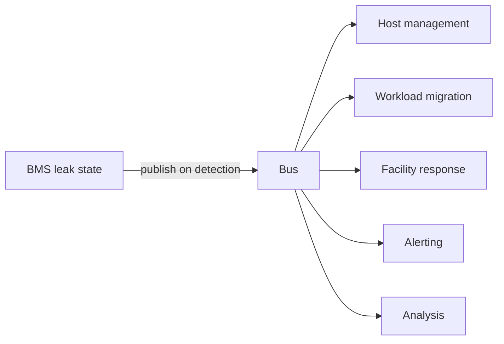
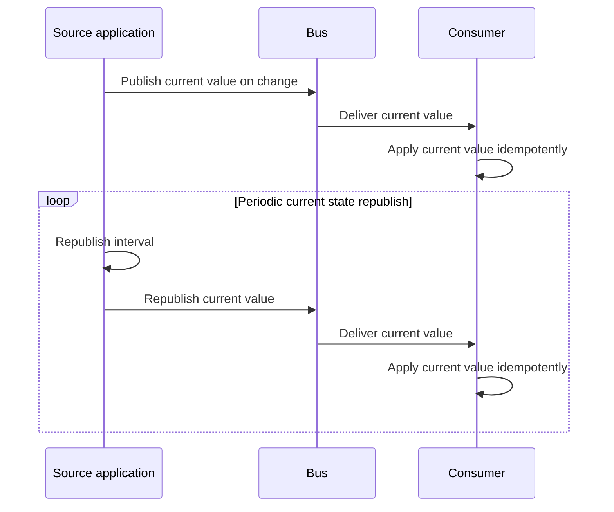
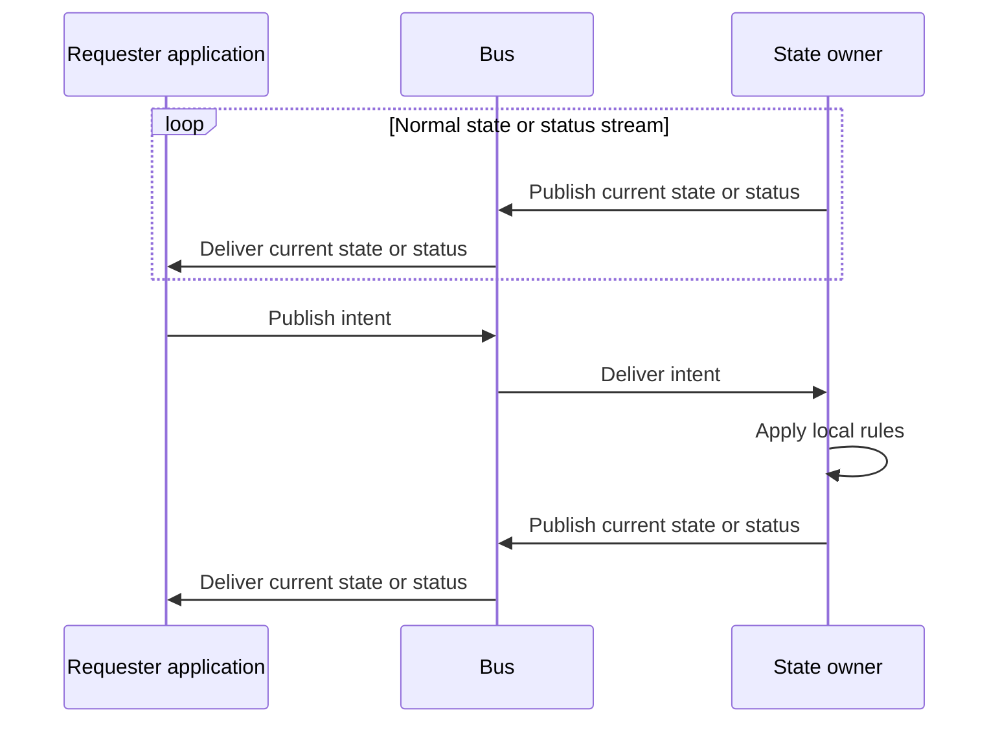

# Why a Message Bus - Stateless Async

At gigawatt scale, polling breaks down quickly. Every application cannot ask every other application for possible updates every second and still leave room for the work that actually matters.

The bus model pushes signals on change and on a cadence, then lets every
interested consumer receive the same signal. A producer does not need to know
who is listening, and a consumer does not need to know who else cares.

## Design Principles

- **Push, Don’t Poll**: React quickly at very large scale without building a polling
  mesh.
- **Publish Once, Fan Out Many**: One state publication reaches all interested
  consumers without per-consumer producer load.
- **Decouple Producers From Consumers**: Producers publish state. Consumers
  independently decide how to react.
- **Converge on Current State**: Consistency comes from publishing current
  state, not preserving a perfect message stream. Failure is corrected by later
  publications, so the system self-heals.

## Polling at 1GW

Leak detection shows why polling breaks down. A liquid rack leak needs fast
reaction, and more than one consumer may care. Host management, workload
migration, facility response, alerting, and analysis may all need it. Waiting
for the next minute or five-minute poll is too slow, and having every consumer
poll the BMS every second is wasteful.

The BMS publishes the leak state when it changes. The bus fans that
publication out to the consumers that need it.



| Polling mesh | Stateless async bus |
| :----------- | :------------------ |
| Every consumer polls each producer | Producer publishes each message once |
| Fast reaction needs tight polling | Fast reaction comes from push delivery |
| Adding consumers adds producer load | Adding consumers adds bus load |

Push delivery replaces every application polling
every other application and improves reaction times.

## Stateless by Default

DSX Exchange carries live, current state events. It is not a database for every
application's state. The source application owns its state, publishes current
state when it changes, and periodically republishes current state at a cadence
it can sustain.

Consumers converge on current state. Messages should carry _current values_, not
deltas. A temperature message should say the current temperature is 24, not that
the temperature changed by 2. Consumers apply those current values idempotently,
so repeated messages are safe.

The normal flow has three parts:

1. Publish when state changes.
2. Periodically republish current state even when it did not change.
3. Consumers process messages idempotently.



Failure can mean a missed update, producer bug, broker problem, network issue,
consumer bug, bad local state, data corruption, power loss across too many
high-availability domains, or any other problem that leaves a consumer with the
wrong state. The next update or periodic current state republish gives the
consumer the current value again.

This design gives the system eventual consistency and self-reconciliation.
Change publications provide fast reaction, while slower scheduled republishes
provide reconciliation. If local state drifts, the next changed state message or
scheduled publish brings it back.

Keeping the bus stateless is both a correctness choice and a performance choice.
_Correctness_ comes from convergence on the source's next current-state
publication. This also repairs a missed message, stale consumer cache, or incorrect local value. The source publishes the current value again and
consumers apply it idempotently. _Performance_ comes from keeping high-rate state
on the live message path without turning each publication into replicated
persistent state.

### The Startup Problem

Bootstrapping consumers is where the stateless event flow needs help. A new
consumer starts with no local view. For fast-changing values, the normal stream
is enough. Consumers subscribe and wait for the next current state publication.

Slow-changing context is different. For example, BMS metadata barely changes, so
a new consumer could wait too long to learn the context needed to interpret live
values. Without a bootstrap path, the consumer may be connected and receiving
live values but unable to use them correctly.

In MQTT, use retained messages for this startup case. DSX Exchange persists the
retained set so a new consumer can build its first view immediately. The
retained set should stay small and slow-changing. Retained messages should be
used as an optimization, not for correctness. The source application still owns
the data and is responsible for republishing for reconciliation. Assume retained
data can eventually be lost. At gigawatt scale, unlikely events happen.

This is a compromise. Retained messages _are_ broker state. Even in memory,
that state has to be stored and replicated, so it has lower maximum throughput
than the stateless live message path. Keep high-rate live values on the
stateless path and recover missed, stale, or incorrect live values through the
next current state publication.

## Decoupled Intent - Remodeling a Sync Request as Async

Traditional synchronous requests can often be modeled as async to gain scaling,
decoupling, and self-healing benefits.

A requester publishes intent when it wants another application to change
something. The state owner uses its own rules to decide what to do with that intent.

The state owner keeps publishing current state or status on its normal stream.
That stream does not depend on an intent message. It is the ongoing source of
truth for every consumer.

If the owner accepts the intent, the next state or status it publishes shows the
accepted value. If the owner ignores it, clamps it, or falls back, the stream
shows that result instead. The requester confirms the outcome by reading the
same stream as every other consumer.

The state owner does not need a response topic, callback address, or connection
back to the requester.



## BMS Setpoint Example

Even straightforward synchronous requests such as "set the target temperature
for a CDU" can be modeled as async. With this model, multiple integrating systems
can see and direct BMS state without increasing the load on the BMS.

A CDU liquid temperature control loop has three values in the bus model:

- The current temperature is what the BMS measures and publishes.

```text
BMS/v1/PUB/Value/CDU/LiquidTemperature/{currentTemperatureTagPath}
```

- The target setpoint is what the BMS is trying to hold, and publishes as BMS
  state.

```text
BMS/v1/PUB/Value/CDU/LiquidTemperature/{targetSetpointTagPath}
```

- The requested target setpoint is what the integration wants the BMS to use.
  The integration publishes it on the topic the BMS listens to.

```text
BMS/v1/{integration}/Value/CDU/LiquidTemperatureSpRequest/{requestTagPath}
```

The requested target setpoint is intent. The BMS may apply it, ignore it, clamp
it to a configured range, or fall back to a local default. The integration does
not get a callback from the BMS.

Confirmation comes from the BMS published target setpoint. If the BMS accepts
the request, the target setpoint changes to the accepted value. If the BMS
clamps or falls back, the target setpoint shows the value the BMS actually
chose. The current temperature remains the measured value.

## When not to use a Bus

Async is the right approach for live state, fan-out, and decoupled integration, but it is not the right approach for every workflow.

Use a direct API when one caller needs an immediate response from one known
owner before it can continue. Provisioning a machine, rebooting a known host,
creating a VPC, or changing a setting that requires acknowledgement of that
exact request are better as direct requests.

DSX Exchange can still carry the resulting resource state after the direct API
call creates or changes the resource. That gives interested consumers a native
async state stream without making the bus part of the synchronous request path.

## Practical Checklist for AsyncAPI Design

- Publish the current value when it changes.
- Republish the current value periodically at a cadence the source can sustain.
- Make repeated current-value messages safe to process idempotently.
- Prefer current values over deltas.
- Include a timestamp for when the value was observed or created.
- Include enough identifying information in the topic, metadata, or subject for
  consumers to know which value is being updated.
- Include a correlation field if a later status message must tie back to an intent
  or request.
- Retain infrequently-changing metadata needed at startup.
- Do not retain frequently-changing live values.

## Related Docs

- [Architecture](architecture.md)
- [BMS Integration](bms-integration.md)
- [BMS Event Bus Schema](schema-bms.mdx)
- [NICo Host State Schema](schema-nico.mdx)
- [Power Management Schema](schema-power-management.mdx)
